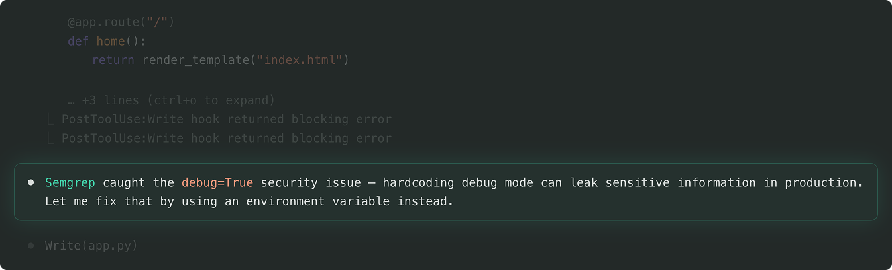
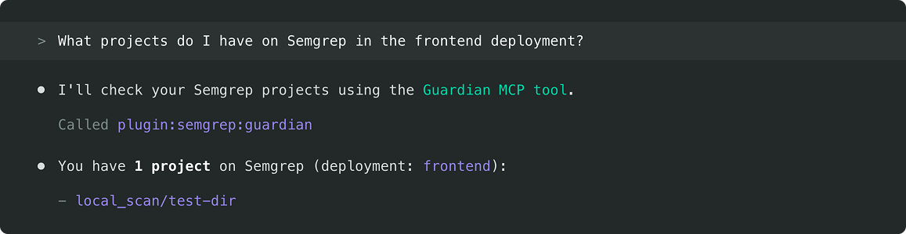
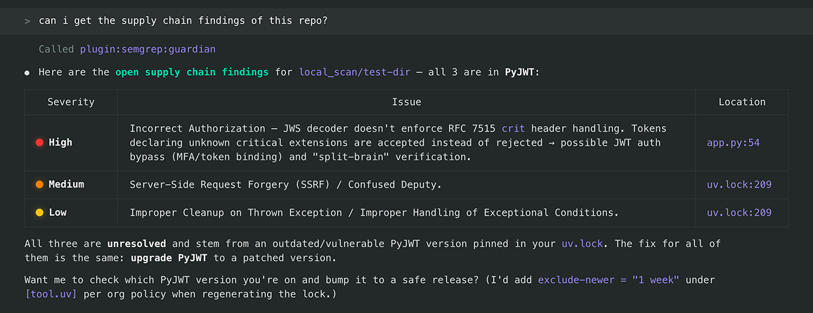

# Semgrep Guardian: Claude Code Plugin
### A plugin that lives in your IDE, detecting and resolving the vulnerabilities, malicious packages, and hardcoded secrets your agent introduces before a PR is ever opened.
[Semgrep](https://semgrep.dev) Guardian integrates natively with AI coding agents like Claude Code and Cursor to catch security issues before they ship. It bundles the Semgrep [MCP server](https://modelcontextprotocol.io/docs/getting-started/intro), Hooks, and Skills into a single install, and scans every file an agent generates using Semgrep Code, Supply Chain, and Secrets. When findings are detected, the agent is prompted to regenerate code until Semgrep returns clean results or you choose to dismiss them.

[Model Context Protocol (MCP)](https://modelcontextprotocol.io/) is a standardized API for LLMs, Agents, and IDEs like Claude Code, Cursor, VS Code, Windsurf, or anything that supports MCP, to get specialized help, get context, and harness the power of tools. Semgrep is a fast, deterministic static analysis tool that semantically understands many [languages](https://semgrep.dev/docs/supported-languages) and comes with over [10,000 rules](https://semgrep.dev/registry). 🛠️

> [!NOTE]
> This project is under active development. We would love your feedback. Join the `#mcp` [community Slack](https://go.semgrep.dev/slack) channel!

### :rocket: Installation instructions:


**Get started in under 2 minutes** — run these five commands inside Claude Code.

1. Start a Claude Code instance by running:
    ```
    claude
    ```
1. Add the Semgrep marketplace by running the following command in Claude:
    ```
    /plugin marketplace add semgrep/guardian
    ```
1. Install the plugin from the marketplace:
    ```
    /plugin install semgrep@semgrep-marketplace
    ```
1. Tell claude to load the plugin:
    ```
    /reload-plugins
    ```
1. Ask claude to login to semgrep, using the guardian mcp
    ```
    login to semgrep
    ```

    This should call into the MCP, but if claude is having trouble,
    call `/clear` to restart claude, or exit and reopen claude manually.

## What's included in the Semgrep Guardian?

The Semgrep Guardian is a plugin that installs directly into any AI coding
agent. It bundles three components; an MCP server, hooks, and skills. We ensure
every line of AI-generated code is scanned against your org's policies before it
ever reaches a pull request. No more delaying PR's due to vulnerabilities
generated by AI.

<table>
<tr>
<td width="33%" valign="top">

### MCP Server

The agent asks Semgrep and Semgrep answers. The MCP server exposes Semgrep's
scanning capabilities as tools the agent can call directly.

[Learn more about the MCP →](https://semgrep.dev/docs/guardian)

</td>
<td width="33%" valign="top">

### Hooks

Consistent scanning that your team can rely on. Hooks fire on every file write,
ensuring a scan regardless of what the agent does.

[Learn more about Hooks →](https://semgrep.dev/docs/guardian)

</td>
<td width="33%" valign="top">

### Skills

Skills are instructions that can interpret a Semgrep finding, describe what
remediation steps to take, and how to get Guardian configured in your
environment.

[Browse Semgrep Skills →](https://github.com/semgrep/skills)

</td>
</tr>
</table>

### Catch security issues in realtime, before you push your code.


### Easily pull data from the Semgrep app via the MCP server.


### Use Semgrep MCP to provide context to your agent for remediation, without leaving your terminal.
