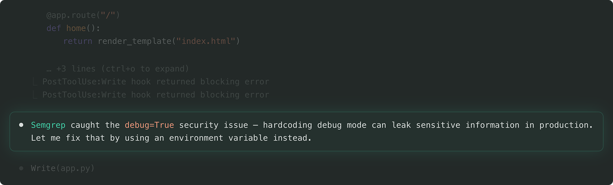
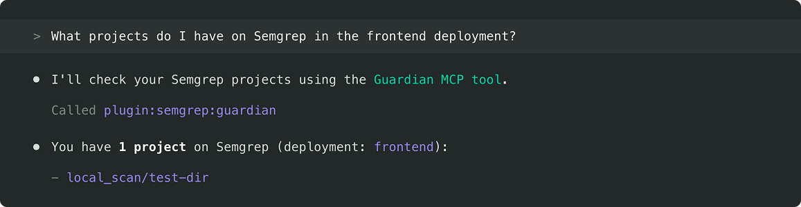
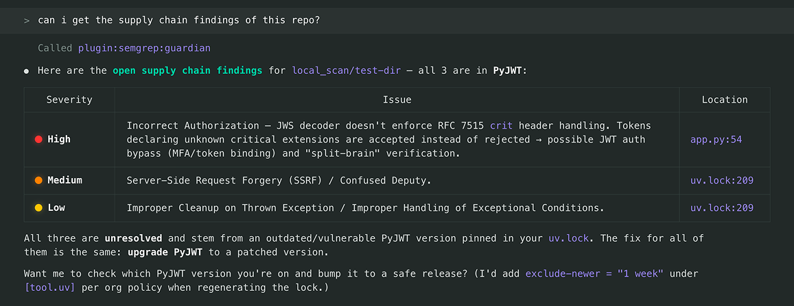

# Semgrep Guardian: Claude Code Plugin
### A plugin that runs in Claude Code, detecting and resolving the vulnerabilities, malicious packages, and hardcoded secrets your agent introduces before code even gets pushed.
[Semgrep](https://semgrep.dev) Guardian integrates natively with AI coding agents like Claude Code and Cursor to catch security issues before they ship. It bundles the Semgrep [MCP server](https://modelcontextprotocol.io/docs/getting-started/intro), and Hooks into a single install, and scans every file an agent generates using Semgrep Code, Supply Chain, and Secrets. When findings are detected, the agent is prompted to regenerate code until Semgrep returns clean results or you choose to dismiss them.

> [!NOTE]
> This project is under active development. We would love your feedback. Join the `#mcp` [community Slack](https://go.semgrep.dev/slack) channel!

### :rocket: Installation instructions:


**Get started in under 2 minutes** — follow these five steps inside Claude Code.

1. Start a Claude Code instance:
    ```
    claude
    ```
1. Open the plugin manager:
    ```
    /plugin
    ```
1. Go to **Discover**, search for **Semgrep**, and click **Install**.
1. Tell Claude to load the plugin:
    ```
    /reload-plugins
    ```
1. Ask Claude to login to Semgrep to kickoff onboarding:
    ```
    login to semgrep
    ```

    This calls into the Guardian MCP server. If Claude has trouble, run `/clear` to restart Claude, or exit and reopen it manually.


## What's included in the Semgrep Guardian?

The Semgrep Guardian is a plugin that installs directly into any AI coding
agent. It bundles two components; an MCP server and hooks. We ensure
every line of AI-generated code is scanned before it
ever reaches a pull request. No more delaying PR's due to vulnerabilities
generated by AI.

<table>
<tr>
<td width="50%" valign="top">

### MCP Server

The agent asks Semgrep and Semgrep answers. The MCP server exposes tools to access Semgrep's
findings so the agent can call them directly.

[Learn more about the MCP →](https://semgrep.dev/docs/guardian)

</td>
<td width="50%" valign="top">

### Hooks

Consistent scanning that your team can rely on. Hooks fire on every file write,
ensuring a scan regardless of what the agent does.

[Learn more about Hooks →](https://semgrep.dev/docs/guardian)

</td>

</tr>
</table>

### Catch security issues in realtime, before you push your code.


### Easily pull data from the Semgrep app via the MCP server.


### Use Semgrep MCP to provide context to your agent for remediation, without leaving your terminal.



## Rolling out Guardian across your team

For specific guidance to roll out Semgrep Guardian via an MDM or via your
agent's built-in enterprise security controls, view this detailed documentation
to help your security team enforce the standardization of Guardian across all
their developers. For more details, this is how you roll it out:
[Rolling out Semgrep Guardian](docs/rollout.md).
